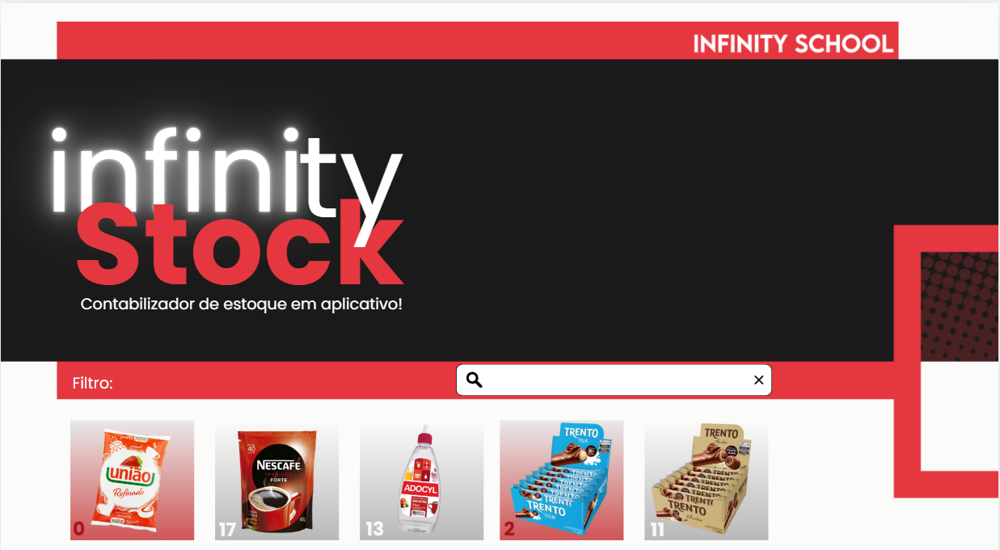

O **INFINITY-STOCK** é um sistema de gerenciamento de estoque com foco em funcionalidades essenciais para empresas que desejam administrar seus produtos de forma eficiente e segura.
  

---
## 📌 Funcionalidades do Sistema

### 1. Autenticação e Controle de Acesso

- **Login/logout seguro** utilizando JWT
- **Cadastro de usuários** com diferentes níveis de acesso (Admin, Funcionário)
- **Recuperação de senha** via e-mail
  

### 2. Gestão de Produtos
- **Cadastro, edição e exclusão** de produtos
- **Upload de imagens** para cada produto
- **Identificação por código de barras** para agilidade nas operações

  

### 3. Controle de Estoque
- **Registro de entrada e saída** de produtos
- **Histórico de movimentações** de estoque
- **Alertas automáticos** para estoque baixo

  

### 4. Relatórios e Dashboards
- **Relatórios detalhados** de estoque e movimentações
- **Gráficos dinâmicos** para análise (Recharts)
- **Exportação de relatórios** em CSV/PDF

  

---

## 💡 Futuras Expansões

- Suporte para múltiplas lojas e filiais
- Aplicativo mobile (React Native)
- Integração com APIs externas

  

---

## 📄 Licença

Este projeto está sob licença MIT.
