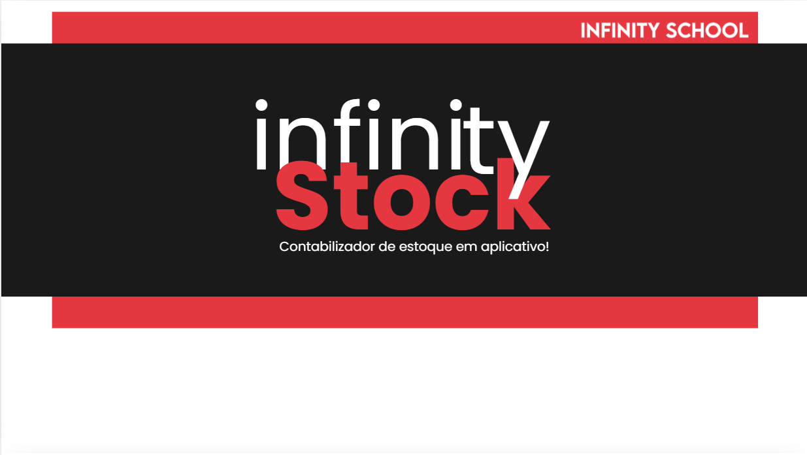
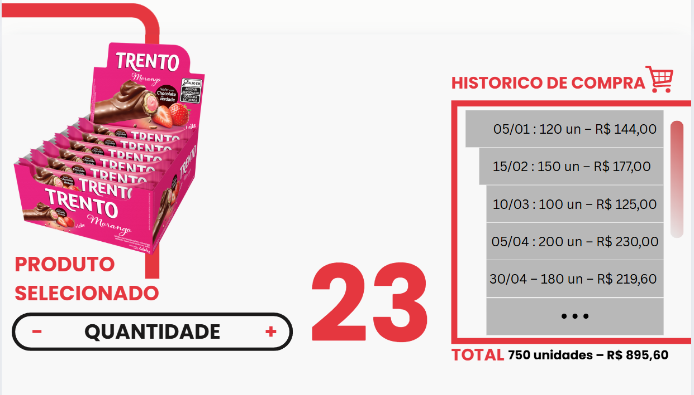

Aqui está uma sugestão para melhorar seu README e torná-lo mais atrativo para recrutadores. O objetivo é destacar suas habilidades, tecnologias utilizadas, diferenciais do projeto e facilitar a compreensão do seu trabalho.

---

# INFINITY-STOCK

Sistema completo de gerenciamento de estoque, focado em eficiência, segurança e escalabilidade para empresas de todos os portes.

---

## 🚀 Sobre o Projeto

O **INFINITY-STOCK** oferece uma solução moderna para controle de estoque, com autenticação segura, gestão de produtos, relatórios avançados e interface intuitiva. Desenvolvido com foco em boas práticas, escalabilidade e experiência do usuário.

---

## 💼 Principais Funcionalidades

- **🔒 Autenticação & Controle de Acesso**
  - Login/logout seguro (JWT)
  - Cadastro de usuários (Admin, Funcionário)
  - Recuperação de senha via e-mail

- **📦 Gestão de Produtos**
  - Cadastro, edição e exclusão de produtos
  - Upload de imagens individuais
  - Identificação por código de barras

- **📈 Controle de Estoque**
  - Registro de entrada e saída
  - Histórico completo de movimentações
  - Alertas automáticos para estoque baixo

- **📊 Relatórios & Dashboards**
  - Relatórios detalhados de estoque e operações
  - Gráficos dinâmicos (Recharts)
  - Exportação em CSV/PDF

---

## 🛠️ Tecnologias Utilizadas

- **Frontend:** HTML, CSS
- **Backend:** [Adicione aqui, se houver, ex: Node.js, Express]
- **Autenticação:** JWT
- **Relatórios:** Recharts
- **Outros:** [Adicione frameworks/bibliotecas extras se usados]

---

## 🌱 Futuras Expansões

- Multi-lojas e filiais
- Aplicativo mobile (React Native)
- Integração com APIs externas

---

## 👨‍💻 Seu Diferencial como Desenvolvedor

- Projeto planejado e estruturado pensando na escalabilidade
- Foco em segurança e boa experiência do usuário
- Uso de boas práticas de desenvolvimento e documentação

---

## 📄 Licença

Este projeto está sob licença MIT.

---

